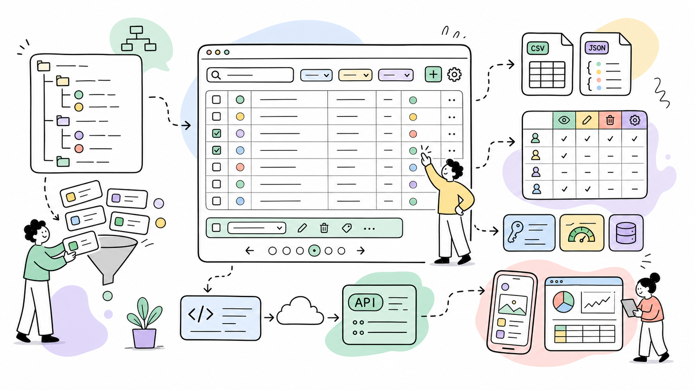

# Collections — ProcessWire Module

**Requires:** ProcessWire 3.0.244+, PHP 8.2+  
**GitHub:** [github.com/mxmsmnv/Collections](https://github.com/mxmsmnv/Collections)



**Author:** Maxim Semenov  
**Website:** [smnv.org](https://smnv.org)  
**Email:** [maxim@smnv.org](mailto:maxim@smnv.org)

If this project helps your work, consider supporting future development: [GitHub Sponsors](https://github.com/sponsors/mxmsmnv) or [smnv.org/sponsor](https://smnv.org/sponsor/).

---

## The Problem

ProcessWire's default Page List is built for site structure — not data management. When you have thousands of pages as data records (products, listings, candidates, menu items), the default admin becomes painful fast:

- **No table view.** You see one page at a time, nested in a tree. Finding a specific record means clicking through folders or memorizing IDs.
- **No inline filters.** Want to see only unpublished products from Italy? You're writing a selector in the URL or building a custom admin page from scratch.
- **No bulk actions.** Publishing 200 seasonal items means 200 individual saves.
- **No export.** Getting your data out requires a custom template or a module.
- **No REST API.** Feeding a mobile app or a headless frontend means building endpoints yourself.
- **No role scoping.** Every editor sees every page. Limiting a franchisee to their own location's menu requires custom code.

Every ProcessWire developer has solved some version of this problem on every project. Collections solves it once.

---

## What It Does

Collections gives any ProcessWire template a configurable admin table — with live search, dropdown filters, inline status toggles, bulk actions, CSV/JSON export, and a REST API — all configured through a UI, without writing code.

It installs as a dedicated section inside the ProcessWire admin. Editors get a professional, responsive interface. Developers get a REST API with zero boilerplate.

---

## Real-World Use Cases

**Product catalog (e-commerce)**
A spirits retailer manages 12,000+ products across ABV, country, region, brand, SKU, and size variants. Collections provides a filterable table where buyers bulk-publish seasonal items, export the filtered view to CSV for distributors, and jump to edit any row — without leaving the list.

**Property listings (real estate)**
An agency runs listings across multiple cities. Each agent sees only their own listings via the permissions matrix and a `created_by` selector. The manager sees everything and exports weekly JSON reports fed to a mobile app through the built-in REST API.

**Job board / HR**
A company posts vacancies across departments. HR manages the full board; department heads see only their own roles. When a hiring round closes, one bulk action archives the filled positions. Status dots show at a glance what's live and what's in draft.

**Restaurant chain / franchise**
A franchise with 40 locations manages its menu centrally. Each location's menu is a separate collection scoped by a selector. The head chef publishes globally; location managers toggle availability for their own restaurant only — same module, different permission roles.

**Media / editorial**
A magazine team of writers and editors. Writers see their own drafts; editors see everything. Publish status is inline — no need to open each article. Bulk-scheduling a campaign batch takes seconds.

**SaaS client portal**
A B2B platform manages client projects as ProcessWire pages. Each account manager sees only their client records. The REST API feeds a React dashboard with paginated, filtered data using Bearer token auth.

**Headless CMS with Next.js / Nuxt / SvelteKit**
ProcessWire as the content backend, Collections as the REST layer. Frontend frameworks fetch data from `/api/products/?filter[category]=42&sort=modified&dir=desc`. No custom API templates needed.

**Mobile app backend**
iOS/Android apps consume the Collections API. API keys with expiration dates and usage tracking provide per-app access control. The `/schema/` endpoint lets the app self-describe available fields without hardcoding.

---

## Features

**Admin UI**
- Configurable table columns per collection with custom labels
- User-definable sidebar groups, with `content`, `taxonomy`, `custom`, and existing custom groups offered as suggestions
- Live search with 300ms debounce, multi-field, including Page reference fields
- Dropdown filters for FieldtypePage and FieldtypeOptions fields
- Inline status toggle (publish / unpublish) via AJAX — no page reload
- Clickable rows with visual selection highlight themed to `--pw-main-color`
- Bulk actions: publish, unpublish, delete with CSRF protection
- Quick delete button per row (optional)
- Collapsible sidebar with persistent state (localStorage)
- "View in Collection" button injected into each page's edit form
- Admin UI colors adapt to ProcessWire's `--pw-main-color` theme variable

**Data**
- CSV and JSON export with current search/filter state preserved, toggleable per collection
- Configuration export / import as JSON
- Role-based permissions matrix (global and per-collection)

**REST API**
- Bearer token, query param (`?api_key=`), HTTP Basic Auth, and PW session
- API key management with optional expiration dates and per-key capability scopes
- SHA-256 hashed keys — raw key shown only once on creation
- Usage tracking: last used timestamp, request count
- Rate limit: 100 requests/minute per IP per collection (HTTP 429 on excess)
- WireCache support for GET responses (configurable TTL)
- Endpoints for list, read, create, update, delete, bulk actions, schema, and export

**Field Types Supported**
Text, Textarea, Integer, Float, Checkbox, URL, Email, Color (hex), Date/Datetime, Image, File, FieldtypeFileB2, FieldtypePage (single and multi), FieldtypeOptions, MapMarker, Profields Table, Profields Textareas, Profields Multiplier, Profields Repeater Matrix, Profields Combo

**Dot-notation column syntax**
Subfields of composite ProFields can be addressed directly in the Columns setting using `field.subfield` notation. The renderer auto-detects field types at each level — no type prefix needed.

| Syntax | Field type | Result |
|---|---|---|
| `address.city` | Combo | Single subfield value |
| `address.type` | Combo (Radio) | Resolved label (e.g. `brewery` → `Brewery`) |
| `address.certification` | Combo (Checkboxes) | All selected labels joined with `, ` |
| `blocks.title` | Repeater Matrix | Subfield from first item (any type) |
| `blocks.hero.title` | Repeater Matrix | Subfield from first item of type `hero` |
| `blocks.hero.image` | Repeater Matrix | Thumbnail from typed item |
| `media.property_photos.photos` | Matrix → Repeater | First Repeater item's image field |
| `media.property_photos.photos_category` | Matrix → Repeater | First Repeater item's Options field |
| `media.photo.property_photos.photos` | Matrix[type] → Repeater | Typed Matrix item → Repeater → subfield |
| `prices.amount` | Table | Column value from first row |
| `prices.*.amount` | Table | All rows' `amount` values, joined with `, ` |
| `options.*.wine.color` | Matrix (wildcard) | `color` from all items of type `wine`, joined |
| `options.*.title` | Matrix (wildcard) | `title` from all items regardless of type |

---

## Installation

1. Copy the `Collections/` folder to `site/modules/`
2. In the admin go to **Modules → Refresh**
3. Install **Collections** — `ProcessCollections` installs automatically
4. Go to **Admin → Collections → Configure** to create your first collection

---

## Quick Start

Go to **Admin → Collections → Configure**, click **New Collection** and fill in:

| Field | Example | Notes |
|---|---|---|
| Key | `products` | Lowercase slug, URL-safe, unique |
| Label | `Products` | Display name in sidebar and header |
| Template | `product` | ProcessWire template name |
| Selector | `parent.name=shop` | Optional extra PW selector to scope results |
| Columns | `title, sku, brand, country, modified` | Comma-separated field names |
| Search fields | `title, sku` | Fields queried by the search bar |
| Search related | enabled | Also search titles of related Page reference fields |
| Sort by | `title` | Default sort field |
| Sort dir | `asc` | `asc` or `desc` |
| Per page | `40` | Overrides global default (0 = use global) |
| Order | `10` | Position in the sidebar/dashboard group |
| Group | `content` | Sidebar group key. Use `content`, `taxonomy`, `custom`, or type a custom group name |
| Icon | `fa-box` | FontAwesome 4 icon class |
| Export enabled | enabled | Allows CSV / JSON export for this collection |

Group names are sanitized as ProcessWire names (`a-z`, `0-9`, `_`, `-`). The configure form suggests the three built-in groups plus any custom groups already used by existing collections.

---

## Global Settings

**Admin → Collections → Configure → Global Settings**

| Setting | Default | Description |
|---|---|---|
| Show ID column | on | Prepends the page `id` to every table |
| Show Status column | on | Colored dot: green=published, red=unpublished, yellow=hidden |
| Show Name column | off | Page `name` (URL slug) |
| Inline status toggle | on | Publish/unpublish without leaving the list |
| Quick delete button | off | Trash icon in each row's action column |
| Confirm batch delete | on | Confirmation dialog before bulk delete |
| Live search | on | Search fires as you type (300ms debounce) |
| Min search length | 2 | Minimum characters before search fires |
| Default per page | 25 | Rows per page when collection doesn't override |
| Date format | `M j, Y` | PHP `date()` format string for date fields |
| Thumbnail size | `32 × 32` | Width × height of image thumbnails in the table (32–128 px) |
| Enable REST API | off | Must be enabled to use any API endpoint |
| API base path | `/api/` | URL prefix for all endpoints |
| Enable API cache | off | Caches GET responses using WireCache |
| Cache TTL | 300 | Cache lifetime in seconds |

---

## REST API

Full API reference and code examples for cURL, JavaScript, PHP, Python, Next.js, and React Query are in [API.md](API.md).

---

## Permissions

| Permission slug | Description |
|---|---|
| `collections-view` | View collection pages and use the table UI |
| `collections-create` | Create new pages via admin or API |
| `collections-edit` | Edit pages, toggle status, bulk publish/unpublish |
| `collections-delete` | Delete pages individually or in bulk |
| `collections-configure` | Access the Configure tab, create/delete collections |
| `collections-export` | Export collection data as CSV or JSON |

Assign permissions to roles under **Access → Roles** in ProcessWire, then configure which roles have which capabilities per collection under **Configure → Permissions**.

---

## Database Tables

Four custom tables are created on install and dropped on uninstall:

| Table | Contents |
|---|---|
| `collections_items` | Collection definitions stored as JSON rows |
| `collections_global` | Global settings as key/value pairs |
| `collections_permissions` | Role capability matrix (JSON per role) |
| `collections_api_keys` | API keys — SHA-256 hash, prefix, expiry, usage stats |

---

## File Structure

```
Collections/
 Collections.module.php          Autoload module — hooks, API routing, cache invalidation
 ProcessCollections.module.php   Admin Process — UI, bulk actions, configure
 src/
   Collection.php                Value object + PW selector builder
   CollectionConfig.php          DB-backed settings storage (4 tables)
   CollectionRenderer.php        HTML table + row renderer, ProFields support
   CollectionQuery.php           PW selector query execution + pagination
   CollectionPermissions.php     Role + capability permission checks
   CollectionExporter.php        CSV / JSON streaming export
   QueryParams.php               QueryParams + QueryResult value objects
   Api/
     CollectionApiRouter.php     REST router + rate limiter (100 req/min)
     CollectionApiHandler.php    CRUD handlers + field serialization
     CollectionApiResponse.php   JSON response wrapper
 views/
   layout.php                    Sidenav + main layout wrapper
   dashboard.php                 Dashboard with collection cards + counts
   collection-list.php           Collection table view + bulk bar
   configure.php                 Configure UI — collections, global, API, permissions, import/export
   partials/
     toolbar.php                 Search input + filter dropdowns
     pagination.php              Pagination widget
 assets/
   collections.js                Live search, AJAX toggle, bulk actions, row selection
   collections.css               Layout, table, sidebar, bulk bar, dark mode theming
 install/
   permissions.php               Creates 6 PW permissions on install
 API.md
 CHANGELOG.md
 README.md
```

---

## Changelog

See [CHANGELOG.md](CHANGELOG.md).

---

## Author

**Maxim Semenov**  
[smnv.org](https://smnv.org) · maxim@smnv.org  
GitHub: [github.com/mxmsmnv/Collections](https://github.com/mxmsmnv/Collections)
